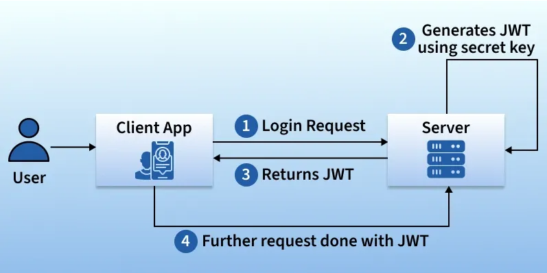
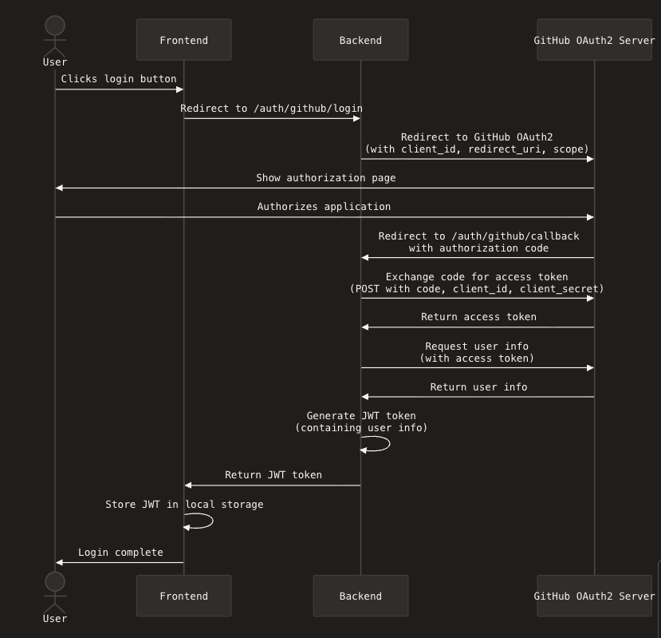

# Module 6: Security  
## 🚀  Overview
- Authentication and authorization
- Register and login flow using a local database
- Password hashing - `passlib` library
- JWT (JSON Web Tokens) - `jose` library
- Securing routes with `JWT` tokens
- `OAuth2` with GitHub
---
## Authentication vs Authorization
User identity vs User permissions <br>
 

---
## Database vs Pydantic models

|Feature	       |Database Model (User)|	Request Model (UserCreate)|
|------------------|---------------|------------|
|Backed by DB table|✅ Yes   	  |❌ No        |
|ORM usage	       |✅ (SQLAlchemy)|❌ (Pydantic)|
|Input validation  |❌	          |✅           |
|JSON schema	   |❌	          |✅           |
|Base class 	   |`Base`         |`BaseModel` |

---
## Register user flow
1. User submits registration form
2. Validate input with Pydantic model
3. Hash password using `passlib`
4. Create User object
5. Save to database
6. Return success response 

---
## Database model for user

```python
from sqlalchemy import Column, Integer, String
from sqlalchemy.orm  import declarative_base
from database import Base

class User(Base):
    __tablename__ = "users"

    id = Column(Integer, primary_key=True, index=True)
    username = Column(String, unique=True, index=True)
    fullname = Column(String)
    email = Column(String, unique=True, index=True)
    hashed_password = Column(String)
```
---
## Pydantic models for user registration
```python
from pydantic import BaseModel

class UserRequest(BaseModel):
    username: str
    fullname: str
    email: str
    password: str

class UserResponse(BaseModel):
    username: str
    email: str 
```
---
## Improvements for UserRequest model

```python
class UserRequest(BaseModel):
    username: str = Field(min_length=3, max_length=30)
    fullname: str = Field(min_length=3, max_length=100)
    email: EmailStr
    password: str = Field(min_length=8)
```

---
## Code Example: Register User
```python
@router.post("/register", response_model=UserResponse)
def create_user(user_req: UserRequest, db: Session = Depends(get_db)):
    existing_user = db.query(User).filter(User.username == user_req.username).first()
    if existing_user:
        raise HTTPException(status_code=400, detail="Username already exists")
    new_user = User(
        username=user_req.username,
        fullname=user_req.fullname,
        email=user_req.email,
        hashed_password=hash_password(user_req.password)
    )
   
    db.add(new_user)
    db.commit()
    db.refresh(new_user)
    response = UserResponse(username=new_user.username, email=new_user.email)
    return response
```
---
## Register User: Q&A
- **Q1:** How are handeld input validation errors?
- **A1:** FastAPI automatically returns `422 Unprocessable Entity` 
  
- **Q2:** How to handle duplicate usernames/emails?
- **A2:** Check in DB before creating user, raise exception if exists

- **Q3:** When is the SQL code generated and executed?
- **A3:** SQL code is executed when `db.commit()` is called.
  
- **Q4:** Why do we use `db.refresh(new_user)`?
- **A4:** To refresh the instance with data from the database (e.g. `id`)

---
## Testing User Registration with `curl`
```bash
curl -X POST "http://localhost:8000/users/register" \
-H "Content-Type: application/json" \
-d '{"username": "testuser3", "fullname": "Test User", 
"email": "foo@dom.com", "password": "password"}'
```

---
## Testing User Registration with Swagger UI
- Open browser and go to `http://localhost:8000/docs`
- Click on the `/users/register` endpoint
- Click "Try it out"
- Fill in the form with user details
- Click "Execute"
- Check the response for success or error messages
--- 
## Login user flow
1. User submits login form
2. Validate input with Pydantic model
3. Check credentials against database
4. If valid, generate JWT token
5. Return token in response
6. Use token for subsequent requests
---
## Pydantic models for user login

```python
from pydantic import BaseModel

class UserLoginRequest(BaseModel):
    username: str
    password: str

class UserLoginResponse(BaseModel):
    message: str
    username: str
    access_token: str
    access_token_type: str = "bearer"
```
---
## Parts of a JWT

Parts of a JWT token: <br>
 

---
## JWT (JSON Web Tokens)

- **Header**: Contains metadata about the token, such as the algorithm used for signing. Base64Url encoded.
- **Payload**: Stores the claims, i.e., data being transmitted. Base64Url encoded.
- **Signature**: Ensures the token's integrity and authenticity. It is generated using the header, payload, and a secret key. 
---


## Create JWT access token

```python
from jose import jwt

SECRET_KEY = "your_secret_key"
ALGORITHM = "HS256"
ACCESS_TOKEN_EXPIRE_MINUTES = 30

def create_access_token(data: dict, expires_delta: timedelta = None):
    to_encode = data.copy()
    expire = datetime.utcnow() + (expires_delta or timedelta(minutes=ACCESS_TOKEN_EXPIRE_MINUTES))
    to_encode.update({"exp": expire})
    encoded_jwt = jwt.encode(to_encode, SECRET_KEY, algorithm=ALGORITHM)
    return encoded_jwt
```
---
## How JWT tokens work?

How JWT tokens work: <br>


---

## Validate user credentials
```python
@router.post("/login", response_model=UserLoginResponse)
def login(user_req: UserLoginRequest, db: Session = Depends(get_db)):
    user = db.query(User).filter(User.username == user_req.username).first()
    
    if not user or not verify_password(user_req.password, user.hashed_password):
        raise HTTPException(status_code=401, detail="Invalid username or password")
    
    access_token = create_access_token(data={"sub": user.username})
    return UserLoginResponse(
        message="Login successful",
        username=user.username,
        access_token=access_token
        )
```
---
## Testing User Login with `curl`
```bash
curl -X POST "http://localhost:8000/users/login" \
-H "Content-Type: application/json" \
-d '{"username": "testuser3", "password": "password"}'
```
Response
```json
{
"message":"Login successful",
"username":"testuser3",
"access_token":"YOUR ACCESS TOKEN",
"access_token_type":"bearer"
}
```

---
## Securing Routes with JWT
- Only logged in users can access the `GET /users` endpoint
- Use `Depends` to inject the token dependency
- `get_current_user` decodes token and returns user
```python
@router.get("/", dependencies=[Depends(get_current_user)])
def get_users(db: Session = Depends(get_db), current_user: User = Depends(get_current_user)):
    users = db.query(User).all()
    return users
```
___
## Get current user from JWT
```python
def get_current_user(token: str = Security(oauth2_scheme), db: Session = Depends(get_db)):
    credentials_exception = HTTPException(
        status_code=401,
        detail="Could not validate credentials",
        headers={"WWW-Authenticate": "Bearer"},
    )
    try:
        payload = decode_access_token(token)
        username: str = payload.get("sub")
        if username is None:
            raise credentials_exception
    except Exception:
        raise credentials_exception
    user = db.query(User).filter(User.username == username).first()
    if user is None:
        raise credentials_exception
    return user
```
---
## Decoding JWT
```python
SECRET_KEY = "your_secret_key"
ALGORITHM = "HS256"
ACCESS_TOKEN_EXPIRE_MINUTES = 30

def decode_access_token(token: str):
    try:
        payload = jwt.decode(token, SECRET_KEY, algorithms=[ALGORITHM])
        return payload
    except jwt.JWTError:
        return None

```
---
## Testing Secured Route with Postman
1. Open Postman
2. Create a new request
3. Set method to `GET` and URL to `http://localhost:8000/users`
4. Go to the "Authorization" tab
5. Select "Bearer Token" from the dropdown
6. Paste the JWT token from the login response
7. Click "Send"
8. You should see the list of users if the token is valid

---
## Create a React app to test the API
- The React app will have a simple UI for 
    - user registration (using local database)
    - user login 
    - displaying all users data
    - deleting a user by ID

---
## Implement OAuth2 with GitHub

- Register OAuth app on GitHub
- Add GitHub OAuth endpoints to FastAPI
- Exchange code for token, get user info
- Match or create user in your DB
- Generate your app’s JWT token
- Redirect to frontend with token
- Store token in frontend and use it like local login
---
## Github OAuth2 login flow

GitHub OAuth2 flow: <br>


---
## Register Your App with GitHub
- Go to: https://github.com/settings/developers
- Click "New OAuth App"
- Set:
    - Application name
    - Homepage URL: http://your-frontend.com
    - Authorization callback URL: http://your-backend.com/auth/github/callback

- GitHub gives you: `CLIENT_ID` and `CLIENT_SECRET`
---

## OAuth2 Flow with GitHub

- **Frontend** button click --> Redirects to **Backend** (`/auth/github/login`) 
- **Backend** (`/auth/github/login`) --> Redirects to **GitHub OAuth2 Server**
- **GitHub OAuth2 Server**: User authorizes --> Redirects to **Backend** with authorization code (`/auth/github/callback?code=...`)
- **Backend** exchanges `code` for `access token` from **GitHub**
- **Backend** retrieves user info from **GitHub** using `access token`
- **Backend** issues `JWT token` containing user info
- **Frontend** receives `JWT token` and stores it in local storage

---
<!-- Markdown URL -->

[GitHub OAuth2 flow](https://claude.ai/public/artifacts/c4114f4b-b87a-4acf-adf6-37426cb9419b)


---
## Code Example: Backend - auth.py
- Endpoints
```
GET /auth/github/login
Redirects to GitHub's OAuth consent page.
```

```
GET /auth/github/callback
GitHub sends users here after login with a code.
```
- Utility function
```
get_or_create_user() 
create or match a GitHub-authenticated user in your DB.
```
---
## Code Example: Frontend - App.jsx
- Add a `Login with GitHub` Button 
```javascript
<a href="https://your-backend.com/auth/github/login">
  <button>Login with GitHub</button>
</a>
```
- Handle the Redirect (JWT Token)
Create a page like `/oauth/callback` to extract the `JWT token` from the URL and store it
---
## Homework

[Link to homework](../module06_security/README.md)
Section: **Practical exercises**

---

## 🎯 Remember
- Database models vs Pydantic models
- Password `hashing` and `JWT` concepts
- Creating secure `register`/`login` flows
- `Securing routes` with dependencies
- `OAuth2` with GitHub

